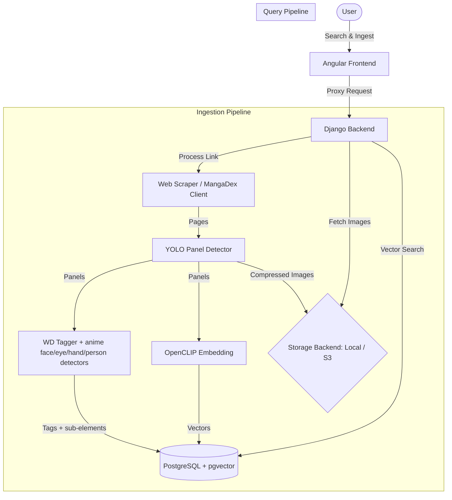

# 📖 Manga Search Engine

A search engine for manga panels. Powered by an Angular frontend and a Django backend, it detects true comic panel boxes with a manga-tuned **YOLO** model, indexes each panel — and every detected face/person region within it — with **booru-style tags** (WD EVA02-Large anime tagger) plus anime **face/eyes/hand/person** detection, and searches those tags first (with an emotion-aware synonym map: `shocked`→`surprised`, `embarrassed`→`blush`, etc.) — falling back to OpenCLIP "vibes" embeddings only for free-text queries with no tag match. Includes automated chapter webscraping (MangaDex integration).

---

## 🚀 Key Features

* **Tag-first Concept Search**: Enter queries like `"eyes"`, `"angry"`, `"chibi"`, or `"hands"`. Queries are mapped to booru tags (via a synonym map + underscore-token overlap) and to detected sub-elements (face/eyes/hand/person), ranked by tagger confidence, with CLIP as a free-text fallback.
* **Flexible Ingestion**:
  * **Direct Image Upload**: Upload single pages. The backend detects panel boxes with a YOLO manga-panel model (OpenCV gutter split as fallback), tags + embeds each panel, and uploads images to the selected storage provider.
  * **Web Scraping Ingestion**: Provide a URL to fetch pages and batch-process all panels.
  * **MangaDex Specific Flow**: Seamless integration with MangaDex chapter URLs. Downloads, processes, splits, and indexes chapters automatically.
* **Optimized Image Pipeline**: Converts uploaded pages into `.avif` formats with custom compression configurations to save storage.
* **Storage Options**: Plug-and-play support for local file storage or Amazon S3.
* **Modern UI**: Clean frontend built with Angular, featuring a responsive search bar, dark mode, and upload tracking.

---

## 🛠️ System Architecture



---

## 📦 Tech Stack

* **Frontend**: Angular 18+, TypeScript, Vanilla CSS
* **Backend**: Django 4.2+, Python 3.10+
* **Image Processing**: OpenCV, Pillow (PIL)
* **AI/Embeddings**: OpenCLIP, Hugging Face
* **Databases**: SQLite (dev) / PostgreSQL + pgvector (production)
* **Storage**: Local filesystem / AWS S3 / Tinify API (compression offloading)

---

## ⚙️ Development Setup

### 1. Prerequisites
Ensure you have the following installed:
* [Node.js](https://nodejs.org/) (v22.x recommended)
* [Python](https://www.python.org/) (v3.10+)
* [Git](https://git-scm.com/)

---

### 2. Backend Installation

1. Navigate to the `backend` directory:
   ```bash
   cd backend
   ```

2. Create and activate a Python virtual environment:
   ```bash
   python3 -m venv .venv
   source .venv/bin/activate
   ```

3. Install dependencies:
   ```bash
   pip install -r requirements.txt
   ```

4. Configure your environment variables:
   ```bash
   cp .env.example .env
   ```
   Open the `.env` file and set the required variables. By default, it will fall back to local storage and SQLite if Postgres/S3 variables are left blank.

5. Apply migrations:
   ```bash
   python manage.py migrate
   ```

6. Run the development server:
   ```bash
   python manage.py runserver
   ```
   The backend server will run on `http://127.0.0.1:8000/`.

   > **Note:** On first ingest/search the backend downloads model weights from
   > the Hugging Face hub (YOLO panel detector + anime detectors + WD tagger),
   > cached under `~/.cache/huggingface`.

7. (Optional) Re-index existing panels with the current pipeline after a model
   or algorithm change:
   ```bash
   python manage.py reingest            # all chapters
   python manage.py reingest --only <chapter_id>
   python manage.py reingest --dry-run
   ```
   MangaDex chapters are re-downloaded and fully re-cropped; direct uploads are
   re-tagged/re-embedded in place (their original page is no longer available).

---

### 3. Frontend Installation

1. Navigate to the `frontend` directory:
   ```bash
   cd frontend
   ```

2. Install Node packages:
   ```bash
   npm install
   ```

3. Start the Angular development server:
   ```bash
   ng serve --open
   ```
   The frontend will compile and automatically open in your default browser at `http://localhost:4200/`.


# manga

Angular & TypeScript + Django & Python

Search for manga panels by typing in vibes

# Features
Search
-User types in text-based search query on frontend e.g. "chibi mad expression"
-Queries the Postgres database and grabfindss the k most nearest vector embeddedings, returning their image file paths
-Backend grabs the actual images from Amazon S3
-Backend gives the filepaths to the frontend

Upload
-Angular frontend takes in an image to a manga page
-Backend compresses the image by converting it into a smaller image type e.g. .avif format
-OpenCV crops the manga panel boxes
-runs the OpenCLIP embedding function
-stores the path to the file & embedding in Amazon S3 (object keys) and Postgres (vectors)
-Uploads the file into  or a local folder on your computer, depending on the ____ flag.

Upload-webscrape
-Angular frontend takes in a link to manga page.
-Webscraper goes onto the manga page and grabs all manga images
- THen follows the upload functionaltiy

# set up
frontend

cd frontend

nvm use 22

"Now using node v22.14.0 (npm v10.9.2)"

ng serve --open
(will take a couple seconds to build then run on:)
http://localhost:4200/

backend